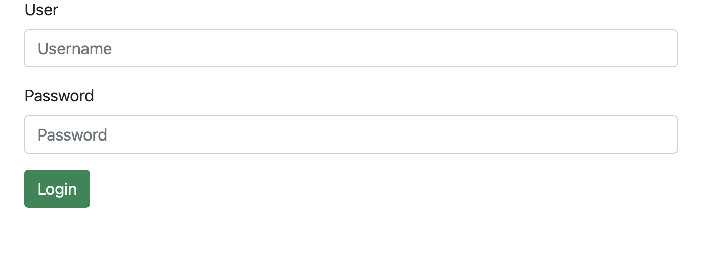
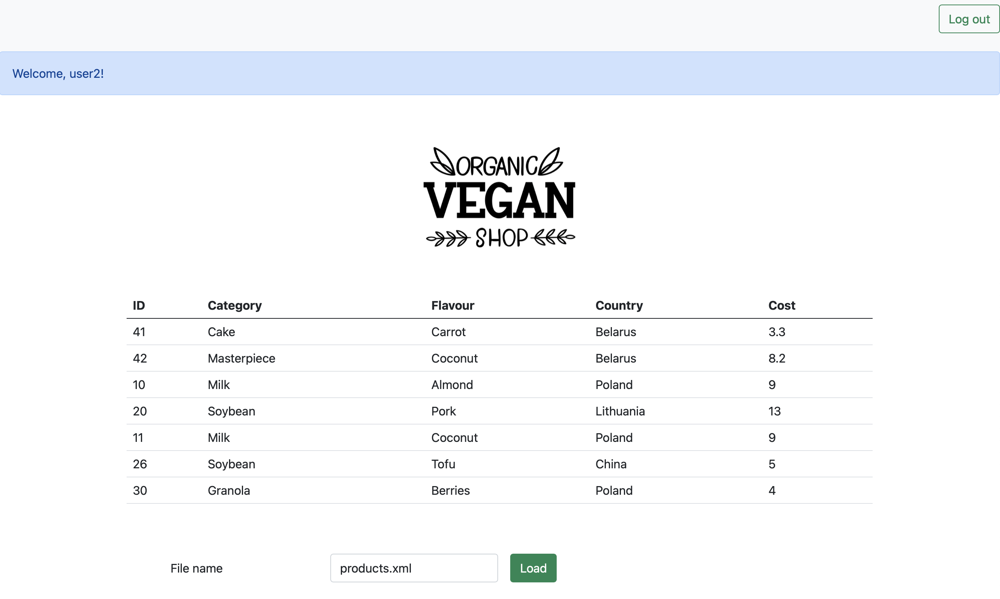

#Laboratory works 6-8. Maven, plugins and tests

###JUnit Tests

Two classes were tested with JUnit. It's STAXParserXML 
and VisitorCreatesUniqueCategoryList. Their testers use a bunch
of xml-files in resources directory.

After testing, I made some conclusions.

STAXParserXML:
- parses perfectly complex structures;
- copes with an incomplete pack of parameters;
- can't parse an empty xml-tag of the type PCDATA 
  (ex. \<id>\</id>);
- doesn't check if the price correct (ex. of the valid price: 2.2).

VisitorCreatesUniqueCategoryList:
- copes with its responsibilities.

###Maven Plugins

Project was built with Maven. List of plugins that was added to project:

- maven-compiler-plugin;
- maven-war-plugin;
- maven-site-plugin;
- maven-project-info-reports-plugin;
- maven-pmd-plugin.

### Maven Web App

In the developed web application user should log in 
to access the main functions. Server searches username 
and password in a MySQL database.

The web app is equipped with AuthenticationFilter 
which redirects unauthorized users to login page.

After a login, users see table-page. They input a file and load information from
it to a table with products. If the file doesn't exist, 
user will be redirected to an error page.

When all work is done, the user may log out.

Here is a login page index.jsp.

Here is a main page table.jsp.

Here is an error page error.jsp.

