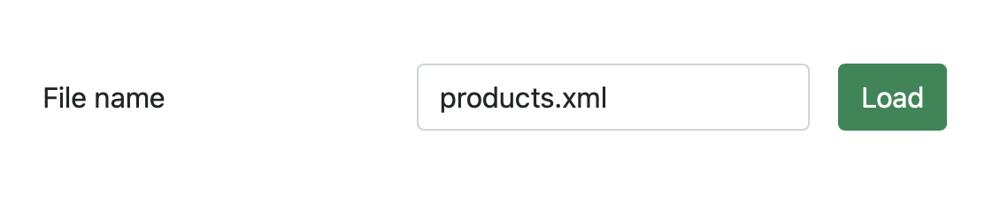
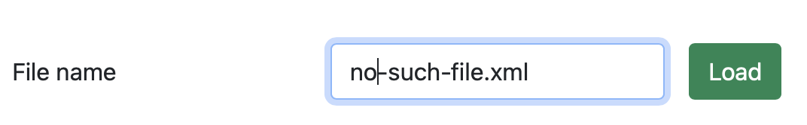

# Laboratory works 6-7. Maven and its plugins

Project was built with Maven. List of plugins that was added to project:

- maven-compiler-plugin;
- maven-war-plugin;
- maven-site-plugin;
- maven-project-info-reports-plugin;
- maven-pmd-plugin.

In the developed web application user inputs a file, then loads information from
it to a table. If the file doesn't exist, user will see error page.

Here is an index.jsp.

A created table with products in table.jsp.

Or error page error.jsp if the file doesn't exist.

